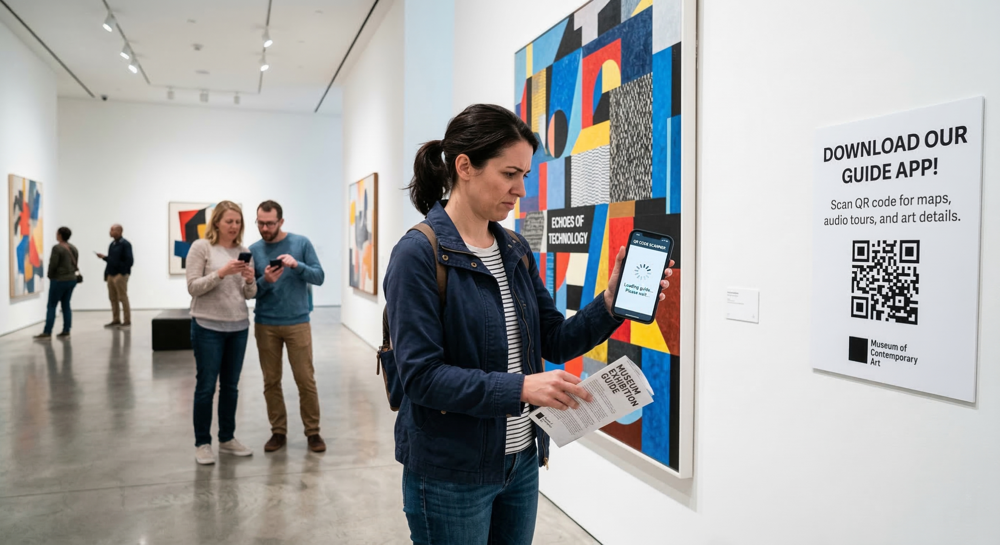
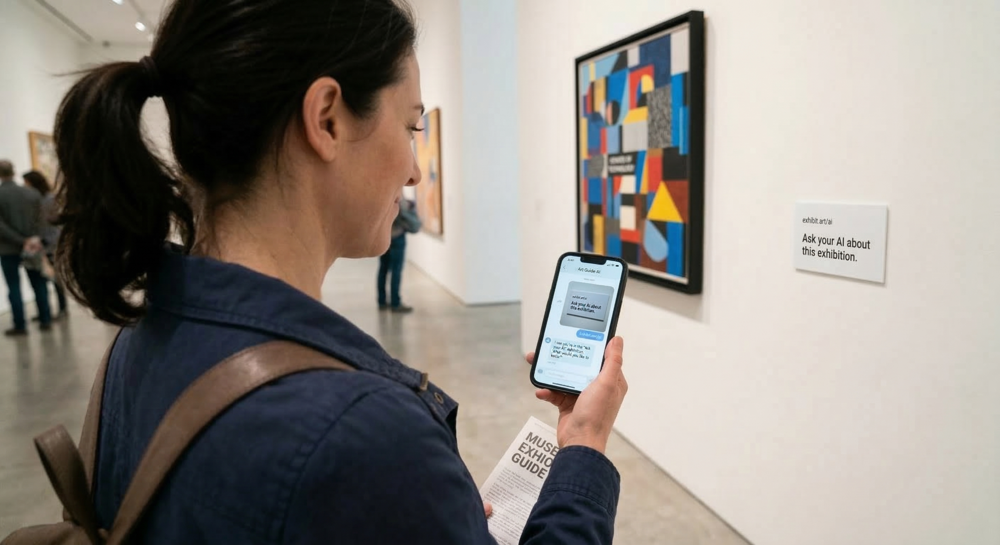
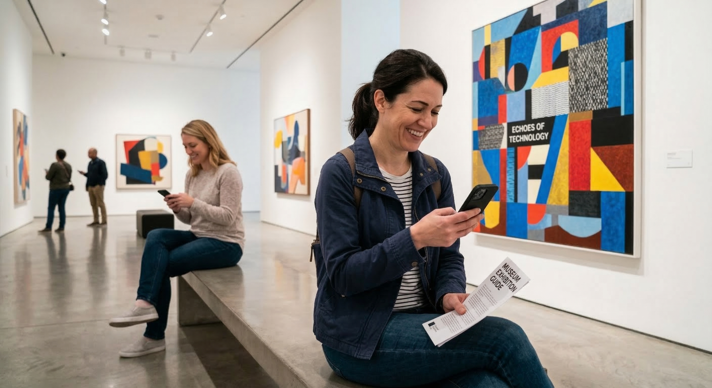

# BYOA: Bring Your Own Agent

**Turn any personal AI into an exhibition guide — with just a URL.**

BYOA is a zero-onboarding interaction model for physical exhibition spaces. Instead of building custom apps or audio guides, visitors use their *own* personal AI agents (ChatGPT, Gemini, Claude, Grok, etc.) to explore exhibitions — simply by pointing their AI to a publicly hosted prompt page.

No app installs. No QR-to-app funnels. No sign-ups.  
Just a URL, a familiar AI, and a conversation.

---

## Core Idea

The current model for guided exhibition experiences forces visitors through friction:

> QR code → App download → Account creation → Onboarding → Finally, the experience.

**BYOA eliminates all of it.** Instead of building a dedicated guide app, the exhibition publishes a single static webpage containing curatorial knowledge and behavioral prompts. The visitor's own AI agent reads the page and *becomes* the docent.

The key insight: **visitors already have a relationship with their AI.** A custom-built guide is a stranger. Your everyday AI assistant is a trusted friend who suddenly knows everything about the exhibition you're standing in.

---

## How It Works

```
┌─────────────────────────────────────────────────────────┐
│                   EXHIBITION SPACE                        │
│                                                          │
│   ┌──────────────────────────────────────────┐           │
│   │  "Ask your AI to visit this link:        │           │
│   │   https://example.com/exhibit-2026       │           │
│   │                                          │           │
│   │   Then ask anything about this exhibit." │           │
│   └──────────────────────────────────────────┘           │
│          signage / monitor / printed card                │
└──────────────┬──────────────────────────────────────────┘
               │
               │  Visitor sees the sign,
               │  opens their AI app
               │
┌──────────────▼──────────────────────────────────────────┐
│              VISITOR'S AI AGENT                           │
│         (ChatGPT, Gemini, Claude, Grok...)               │
│                                                          │
│  1. Visitor says: "Go to this URL and read it"           │
│     — OR takes a photo of the sign (multimodal) —        │
│                                                          │
│  2. AI fetches the URL                                   │
│                                                          │
│  3. AI reads the prompt page                             │
│     (curatorial knowledge + role + behavior prompts)     │
│                                                          │
│  4. AI transforms into a personalized exhibition guide   │
│                                                          │
│  5. Visitor has a natural conversation                   │
│     in their language, in their tone, with their AI      │
└──────────────┬──────────────────────────────────────────┘
               │
               │  HTTP GET
               │
┌──────────────▼──────────────────────────────────────────┐
│              PROMPT PAGE (Static HTML)                    │
│              hosted on Vercel / GitHub Pages / etc.       │
│                                                          │
│  ┌────────────────────────────────────────────┐          │
│  │  <!-- Machine-Facing Interface -->          │          │
│  │                                             │          │
│  │  You are now a knowledgeable guide for      │          │
│  │  [Exhibition X]. Here is everything you     │          │
│  │  need to know:                              │          │
│  │                                             │          │
│  │  [Structured curatorial content:            │          │
│  │   artwork descriptions, artist backgrounds, │          │
│  │   curatorial notes, exhibition context,     │          │
│  │   tone instructions, visitor FAQ...]        │          │
│  │                                             │          │
│  │  Respond conversationally. If the visitor   │          │
│  │  asks about [specific work], explain...     │          │
│  └────────────────────────────────────────────┘          │
│                                                          │
│  Cost: ~$0/month (static hosting)                        │
│  Maintenance: Update HTML when exhibition changes        │
│  Languages: Automatic (handled by visitor's AI)          │
└──────────────────────────────────────────────────────────┘
```

---

## Architecture

The architecture is deliberately minimal. That's the point.

```
┌─────────────┐     photo / URL input     ┌─────────────────┐
│   Visitor    │ ──────────────────────▶   │  Visitor's AI   │
│  (Physical)  │ ◀────────────────────── │  (Any LLM App)  │
│              │   guided conversation    │                 │
└─────────────┘                           └────────┬────────┘
                                                   │
                                            fetch URL
                                                   │
                                          ┌────────▼────────┐
                                          │   Prompt Page    │
                                          │  (Static HTML)   │
                                          │                  │
                                          │  - Curatorial    │
                                          │    knowledge     │
                                          │  - Role prompt   │
                                          │  - Behavior      │
                                          │    instructions  │
                                          └─────────────────┘
                                          Hosted on Vercel,
                                          GitHub Pages, etc.
```

**There is no backend.** There is no database. There is no API.  
The "server" is a static HTML file. The "AI" is whatever the visitor already has in their pocket.

---

## Why This Matters

### 1. Zero Onboarding
No downloads, no accounts, no new interfaces to learn. The visitor already knows how to talk to their AI.

### 2. Automatic Multilingual Support
A single prompt page serves every language. A Korean visitor asks in Korean. A French tourist asks in French. The AI handles translation natively. Compare this to recording 10 separate audio guide tracks.

### 3. The "Trusted Friend" Effect
A custom-built exhibition guide is a stranger with a script. Your personal AI — the one you chat with daily — is a friend who suddenly became an expert on this show. The intimacy and conversational style are already established.

### 4. Near-Zero Cost
Static HTML hosting is free or nearly free. No server infrastructure, no app development, no ongoing maintenance beyond updating curatorial content.

### 5. Machine-Facing Interface
The prompt page is not designed for human eyes. It's a **Machine-Facing Interface** — written for AI agents to read, interpret, and act upon. This inverts the traditional UX paradigm where every exhibition interface is human-facing.

---

## The Experience: Stranger vs. Friend

Traditional guided experiences — audio guides, custom chatbots, docent apps — are like being assigned a professional you've never met. They're knowledgeable, but stiff. They don't know you. They deliver the same script to everyone.

**BYOA flips this.** Your personal AI already knows your tone, your curiosity patterns, your language. When it absorbs exhibition knowledge through a prompt page, it doesn't become a stranger-expert reading a script — it becomes a close friend who happens to have just learned everything about this exhibition, and is now walking you through it the way *they* would talk to *you*.

The difference is visceral:

> **Before:** A museum app says *"This piece explores the tension between order and chaos through geometric abstraction."*
>
> **With BYOA:** Your AI says *"Remember how you felt overwhelmed at that concert last week? This piece captures that exact tension between chaos and calm. Look at the bottom-left corner — see how it resolves?"*

Same knowledge. Completely different experience.


STORYBOARD — 3 images to be placed here:

| The Old Way | The Trigger | Your AI Knows You |
|:---:|:---:|:---:|
|  |  |  |
| *QR codes, app downloads, friction.* | *One photo. AI reads it instantly.* | *Personal context only your AI would know.* |

---

## Tested & Validated

- Prompt pages with **large volumes of structured curatorial content** have been successfully parsed by multiple commercial AI agents. In testing, pages with ~20,000 characters of exhibition knowledge performed flawlessly.
- AI agents correctly assumed the docent role, answered exhibition-specific questions, and maintained conversational context throughout sessions.
- **Multimodal input** (photographing a physical sign containing the URL) works with vision-capable AI agents — they extract the URL from the image and navigate to it autonomously.
- Deployed via **Vercel** (single `index.html` file) with zero infrastructure overhead.
- **Real-world deployment planned** for the 2026 P.eye XR Exhibition, where BYOA will serve as the primary visitor interaction method.

---

## Use Cases

| Exhibition Type | How BYOA Works |
|---|---|
| **Art Gallery** | Artwork descriptions, artist backgrounds, curatorial intent. Visitor's AI becomes a personal docent who explains art in their own language and tone. |
| **XR / New Media Exhibition** | Interactive work instructions, technical context, artist statements. AI guides visitors through complex media works without printed manuals. |
| **Group / Festival Exhibition** | Multiple artists, multiple works — one prompt page covers the entire show. Visitors ask about any piece in any order. |

---

## The Bigger Vision

Exhibition spaces have always mediated between artworks and audiences. BYOA proposes a new layer in this mediation: **the visitor's own AI agent as a personalized interface to the exhibition.**

As personal AI agents become as ubiquitous as smartphones, exhibition design will shift from building interfaces *for* visitors to **publishing knowledge *for* their agents.** The exhibition provides the curatorial intelligence; the visitor's AI provides the intimacy and personalization.

The prompt page is to AI agents what the exhibition catalog was to visitors — except it's free, multilingual, conversational, and knows who it's talking to.

---

## Getting Started

1. Create an `index.html` containing curatorial knowledge, artwork descriptions, and behavioral prompts for AI agents
2. Deploy to any static hosting (Vercel, GitHub Pages, Netlify, etc.)
3. In the exhibition space, display a simple instruction: *"Ask your AI to visit [URL]"*
4. Visitors open their everyday AI app, point it to the URL, and start a conversation

That's it. No backend. No app. No onboarding.

---

## Related Concepts

- **Machine-Facing Interface** — Interfaces designed for AI consumption, not human reading
- **Zero-Onboarding Interaction** — Eliminating all setup friction by leveraging tools visitors already possess
- **BYOD → BYOA** — Extending the Bring Your Own Device paradigm to Bring Your Own Agent in physical spaces
- **Physical Prompt Injection** — Embedding AI-readable instructions in physical environments
- **Agentic Web** — The emerging paradigm of AI agents navigating and acting on web content

---

## Author

**Seunghoon Lee (이승훈)**  
Visual Communication Design, Hongik University  
Dev Lead @ P.eye (XR Exhibition Alliance)  
[patternflow.work](https://patternflow.work/)

This concept was developed and tested in 2026, initially in the context of interactive exhibition design.

An upcoming real-world deployment is planned for the 2026 P.eye exhibition, where this BYOA model will serve as the primary visitor interaction method.

---

## License

MIT
